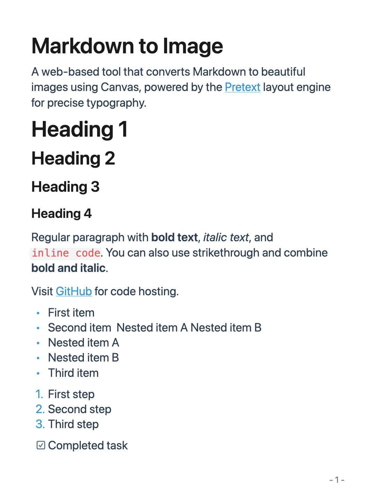
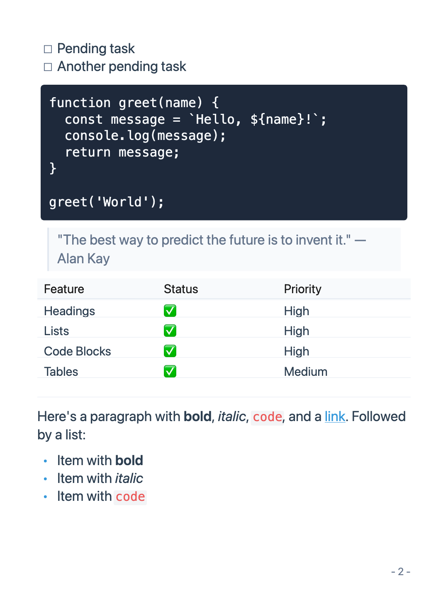
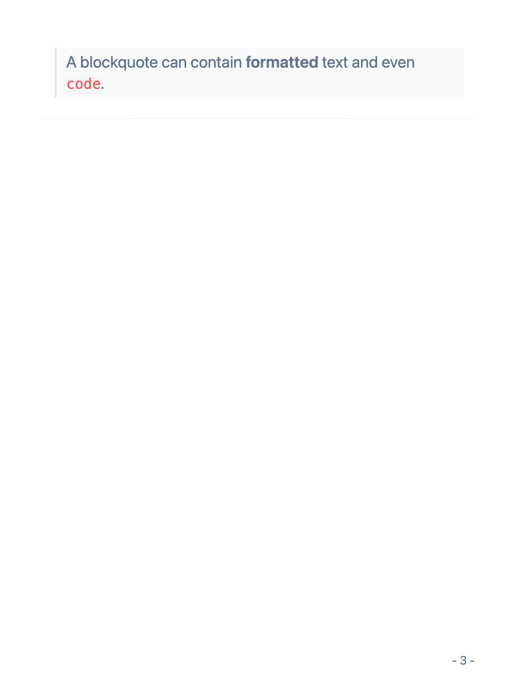

# Markdown to Image

A web-based tool to convert Markdown to beautiful images, built on top of [@chenglou/pretext](https://github.com/chenglou/pretext) - a high-performance text layout engine that performs pure arithmetic-based typography without touching the DOM.

## Installation

```bash
bun install
```

## Quick Start

```bash
bun dev
```

Open your browser and navigate to `http://localhost:3000`.

## Preview





## Features

- ✨ Clean, readable typography powered by Pretext
- 🎨 Multiple themes: Light, Dark, Sepia
- 💻 Code blocks with proper syntax highlighting
- 📋 Support for lists, blockquotes, tables, and more
- 🖼️ Automatic pagination for long content
- 📥 Download as PNG

## Build

```bash
bun run build
```

## Tech Stack

- **Text Layout**: [@chenglou/pretext](https://github.com/chenglou/pretext)
- **Markdown Parser**: [micromark](https://github.com/micromark/micromark)
- **Build Tool**: Vite
- **Runtime**: Bun

## License

MIT
